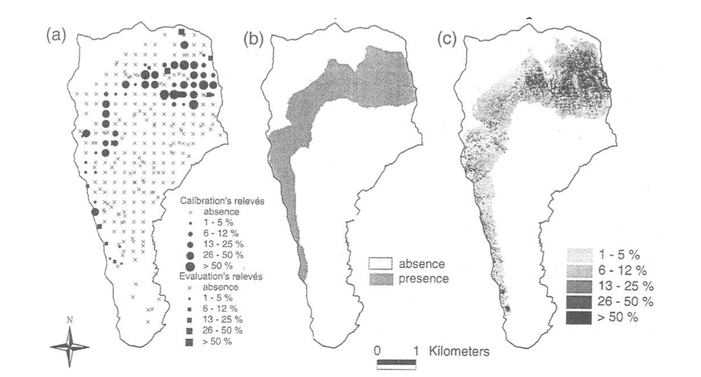
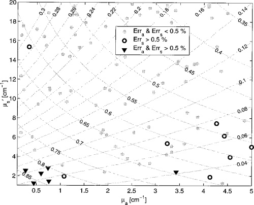

```{r, include = FALSE}
library(mosaic)
library(broom)
options(digits = 6)
```

# Practicing Academic Integrity

If you worked with others or used resources outside of provided course material (anything besides our textbook(s), course materials in Moodle, R help menu) to complete this assignment, please acknowledge them below using a bulleted list. 

<!-- ~~~~~~~~~~~~~~~~ YOU MAY BEGIN EDITING BELOW THIS LINE ~~~~~~~~~~~~~~~~ -->

*I acknowledge the following individuals with whom I worked on this assignment:*

Name(s) and corresponding problem(s)

*

*I used the following sources to help complete this assignment:*

Source(s) and corresponding problem(s)

* 

\newpage


# PROBLEMS TO TURN IN:  Vis 1, Vis 2, CASI 1.1, CASI 1.4, Portfolio Reflection 

## Visualization Problems (Adapted from an assignment by Prof. Horton)

The first two ``problems'' require you to find two visuals to discuss, and incorporate them in a .Rmd file (or .Qmd if you'd like to use Quarto). To find these visuals, we will practice finding journal articles from two sources - the JSTOR database and Google Scholar. 

Your task is to select two visual displays from journal articles that apply statistics (they do not need to be in statistics research journals, but could be). One should be selected as a visual display that you find compelling. The other should be a visual display that you believe is sub-optimal or could be improved. 

One visual must come from JSTOR and the other from Google Scholar - you decide which is which. You must include the article citation and figure information (which figure is it in the article) with each figure. (Citations are more than a URL.)

You should include both images below and a brief commentary for each on why you picked them and why they are compelling or sub-optimal, respectively. 

Instructions for accessing and using JSTOR and Google Scholar:

Google Scholar can be found at the link here [Google Scholar](https://scholar.google.com/).

JSTOR is one of the journal databases available through the College. To get to it, you can:

* Head to the [Library](https://www.amherst.edu/library) page. 
* Click the link (roughly in middle of page) to Browse 'A-Z Databases'.
* Head to the J's and click JSTOR.

What should you search for in these two places to find visuals for this assignment? 

* Think of a statistical method you are comfortable reading about. Examples - regression, ANOVA, etc.
* Think of an application area you'd like to find an article in. 
* Put the application area in a search field (or in JSTOR, select journals from that field - left menu) and the topic in another field
* Look at the search results this generates and pick an article to look at.
* See if any of the figures in the article strike you. If not, go look at another article. 

Instructions to include visuals in a .Rmd:

Once you identify appropriate visuals, you need to save them in a format that can be put in RMarkdown. .png files work, but other file formats can work as well. 

Below are two examples of how visuals can be included in a .Rmd. Part of the purpose of this assignment is so that you learn how to add images to .Rmds looking ahead to the final paper. The image file should be in the current directory (see the output of "getwd()"). See http://rmarkdown.rstudio.com/authoring_basics.html for more details. DELETE these examples before submission. 

## Vis 1 - Compelling

```{r, include = FALSE}
#Be sure to add your commentary!

#And the citation information. 

#Was this from JSTOR or Google Scholar?
```



Guisan, A., Theurillat, J.-P., &amp; Kienast, F. (1998). Predicting the potential distribution of plant species in an Alpine environment. Journal of Vegetation Science, 9(1), 65–74. https://doi.org/10.2307/3237224 

Figure 4

This visualization from JSTOR shows the potential habitat distribution of a plant called Carex curvula, with map (a) being the real observations, map (b) being generated from a binomial logistic model, and map (c) being generated from an ordinal logistic model. I think this is a good visualization, because it contains clear and informative legends, and the features of the visualization are both varied and consistent, as all three maps for the predicted plant distribution are different in method but reflect the same strip of habitation.

## Vis 2 - Suboptimal

```{r, include = FALSE}
#Be sure to add your commentary!

#And the citation information. 

#Was this from JSTOR or Google Scholar?
```



Dam, J. S., Dalgaard, T., Fabricius, P. E., &amp; Andersson-Engels, S. (2000). Multiple polynomial regression method for determination of biomedical optical properties from integrating sphere measurements. Applied Optics, 39(7), 1202. https://doi.org/10.1364/ao.39.001202

Fig. 4

Although it's interesting to see the contoured shape of the plot, I think this visualization from Google Scholar contains too many grid lines and unnecessary labeling. Also, the differing opacities of the point types make the faint ones seem irrelevant on the plot. I also wonder if it is necessary to show those faint ones, since the bold circle and triangles seem to show a pattern across the plot, but the faint points are evenly distributed all around. This could have just been mentioned in the caption and would have cleared up the plot.

\newpage


## CASI 1.1

This problem was chosen to help you remember how to perform regressions and obtain predictions. There are multiple ways to code the solution.  

```{r}
kidney <- read.table("http://web.stanford.edu/~hastie/CASI_files/DATA/kidney.txt", header = TRUE)
```

> (a) Fit a cubic regression, as a function of age, to the kidney data of Figures 1.1 and 1.2, calculating estimates and standard errors at ages 20, 30, 40, 50, 60, 70, 80.

SOLUTION:

```{r}
# Hint, augment is likely to be useful here (loaded in broom package above)
# Do you remember how to add powers to a regression? You can also use mutate. 
# Be sure you actually get a cubic regression! 
# The model must show the appropriate terms.

cub_mod <- lm(tot ~ age + I(age^2) + I(age^3), data = kidney)
msummary(cub_mod)

age <- c(20, 30, 40, 50, 60, 70, 80)
age_vals <- data.frame(age)

aug_data <- augment(cub_mod, kidney, age_vals, se_fit = TRUE)

# print(aug_data[, c("age", ".fitted", ".se.fit.")])
knitr::kable(aug_data, caption = "Fitted Cubic Regression of Kidney Data")
```

> (b) How do the results compare with those in Table 1.1?

SOLUTION:

From ages 20 to 60, the fitted cubic model predicts tot values closer to 0 than the linear regression model does. For ages 70 and 80, the cubic regression predicts tot values of larger magnitude. The standard errors of the cubic model are closest to the linear regression fitted values than the other models, but are larger than the linear regression SE values.

\newpage

## CASI 1.4 - Slightly Modified

This problem was chosen to help you remember the concepts of the bootstrap and permutation/randomization tests. You may have seen these concepts only briefly before. Both are extremely valuable concepts to have knowledge of in your statistical understanding. 

```{r, cache = TRUE}
# Load and format data
leukemia_big <- read.csv("http://web.stanford.edu/~hastie/CASI_files/DATA/leukemia_big.csv")
# says pictures from row 136
gene136 <- t(leukemia_big[136, ]) 
# Need to get ALL and AML tags in
# Labels not provided - found through another source
type <- c(rep("ALL", 20), rep("AML", 14), rep("ALL", 27), rep("AML", 11))

# Set up dataset
leukemia <- data.frame(gene136, type)
leukemia <- rename(leukemia, gene136 = X136)
favstats(~ gene136 | type, data = leukemia)
```

We want to see if there is a significant difference in mean gene expression for gene 136 for the ALL and AML groups. 

> (a) Record the means of the ALL and AML groups for the gene 136 data available for reference.

SOLUTION:

```{r}
mean_all <- 0.752479
mean_aml <- 0.949973
```


> (b) Perform 1000 nonparametric bootstrap replications for the mean of ALL for gene 136. Describe the distribution of the resulting means. You can perform the bootstrap in any way you see fit (the functions do and resample might prove useful).

SOLUTION:

```{r}
set.seed(495)
bootstrap_all <- do(1000) * mean(~ gene136, data = resample(filter(leukemia, type == "ALL"), replace = TRUE))

gf_dens(~ mean, data = bootstrap_all) %>%
  gf_labs(title = "1000 Non-Parametric Bootstrap Replications for the Mean of ALL for Gene 136")

favstats(~ mean, data = bootstrap_all)
qdata(~ mean, c(0.025, 0.975), data = bootstrap_all)
```

The distribution of 1000 nonparametric bootstrap replications for the mean of ALL for gene 136 is unimodal and mostly symmetrically centered around 0.750237. The bootstrapped mean is very close to the mean for ALL from part (a), 0.752479.

> (c) Repeat (b) for AML.

SOLUTION:

```{r}
set.seed(495)
bootstrap_aml <- do(1000) * mean(~ gene136, data = resample(filter(leukemia, type == "AML"), replace = TRUE))

gf_dens(~ mean, data = bootstrap_aml) %>%
  gf_labs(title = "1000 Non-Parametric Bootstrap Replications for the Mean of AML for Gene 136")

favstats(~ mean, data = bootstrap_aml)
qdata(~ mean, c(0.025, 0.975), data = bootstrap_aml)
```

The distribution of 1000 nonparametric bootstrap replications for the mean of AML for gene 136 is unimodal and slightly left-skewed, with mean centered around 0.94699 (median 0.946449 because skewness). The bootstrapped mean is also very close to the mean for AML from part (a), 0.949973.

> (d) Suggest an inference. In other words, what do your results in (b) and (c) suggest about whether there is a difference in means for the ALL and AML groups for gene 136?

SOLUTION:

Based on my results in (b) and (c), specifically the two confidence intervals for the bootstrapped means, there is evidence of a difference in means for the ALL and AML groups for gene 136. The 95% CI for the ALL bootstrapped means is (0.680755, 0.830720), while that for the AML bootstrapped means is (0.853861, 1.044959). The two intervals not overlapping suggests that there is a difference between the means of the two groups.

> (e) Brainstorm an alternative way to approach the problem via a randomization/permutation test. Describe what you would do in a way that someone else could code it up. (You do not need to actually code this up, but you can if you want to see what the result is.)

SOLUTION:

An alternative way to determine whether or not there is a difference between the means of the two groups is to conduct a t-test. By using the t.test() function with the data of the two gene 136 data groups inside, I would be able to determine the presence of a difference between the means, and how significant it is.

\newpage

## Portfolio Reflection

Look at our portfolio review and in-class activities. In a separate word or pdf document, in a few paragraphs, reflect on how the items in your portfolio demonstrate:

* how your statistical analytical skills have developed over time
* how your statistical writing skills have developed over time
* skills you have a solid grasp of (such as R code or visuals or regression)
* skills you would like to improve on

Then, set some goals for what you'd like to work on improving in future statistical reports/work. (Yes, you brainstormed some before, this is asking you to pick some to really focus on!)

Upload this portfolio reflection and goals document for future reports to your portfolio folder in your personal class repo. 

Given what you are asked to include above, I expect the document you generate to have at least 3 paragraphs and contain at least 3 goals for future work. 

