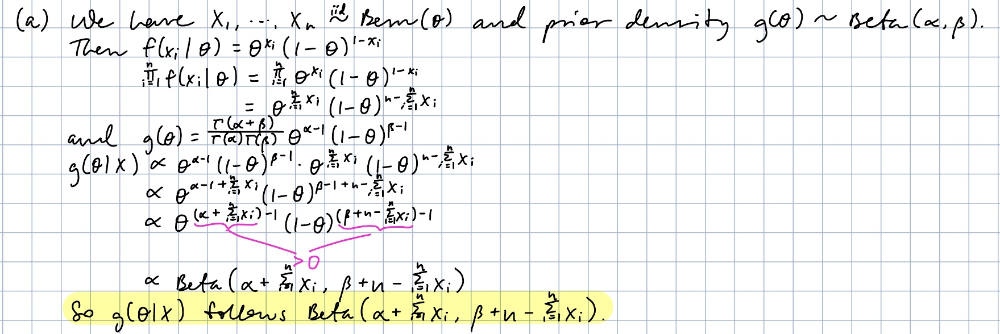
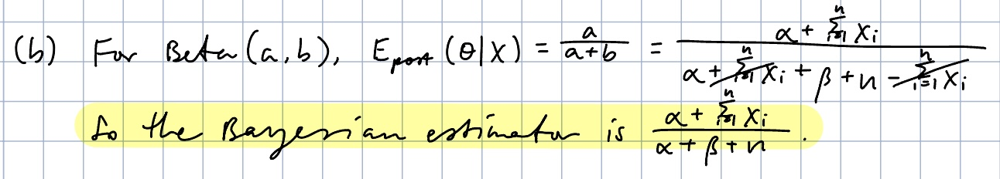
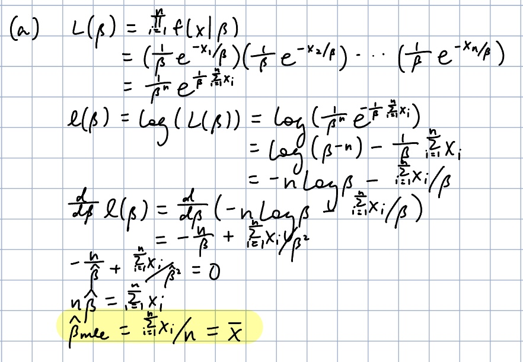
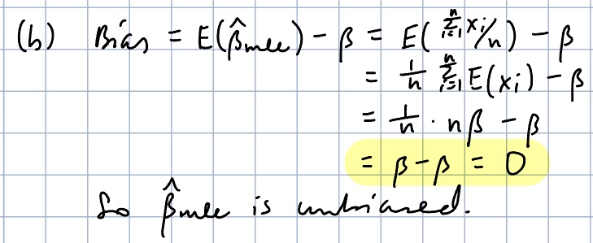
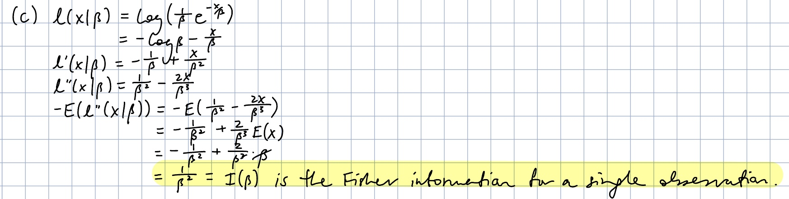

```{r, include = FALSE}
library(mosaic)
library(tidyr)
library(palmerpenguins)
library(mvtnorm)
options(digits = 6)
```

# Practicing Academic Integrity

If you worked with others or used resources outside of provided course material (anything besides our textbook(s), course materials in Moodle, R help menu) to complete this assignment, please acknowledge them below using a bulleted list. 

<!-- ~~~~~~~~~~~~~~~~ YOU MAY BEGIN EDITING BELOW THIS LINE ~~~~~~~~~~~~~~~~ -->

*I acknowledge the following individuals with whom I worked on this assignment:*

Name(s) and corresponding problem(s)

*

*I used the following sources to help complete this assignment:*

Source(s) and corresponding problem(s)

* 

\newpage


```{r, include = FALSE}
library(mosaic)
options(digits = 6)
```

For this assignment, you may do some of the problems on paper if you like, then scan in your solutions and merge with the Integrity page as a cover sheet and any work you are leaving in the .Rmd. If you decide to type in your answers, you will need to use LaTeX to show your work for some problems. 

Because you may merge files into a pdf to submit in any order, be sure to assign pages in Gradescope so I can find work for each problem!

# PROBLEMS TO TURN IN: CASI 2.1, Add 1, Add 2, Add 3, CASI 5.3 (modified), Add 4

## CASI 2.1 

A coin with probability of heads $\theta$ is independently flipped $n$ times, after which $\theta$ is
estimated by 

\[
\hat{\theta} = \frac{s+1}{n+2};
\]

with $s$ equal to the number of heads observed.  $\hat{\theta}$ will be referred to as the estimator below. 

> (a) What are the bias and variance of the estimator?

SOLUTION:

$Bias(\hat{\theta}) = E(\hat{\theta}) - \theta$

$= E(\frac{s+1}{n+2}) - \theta$

$= \frac{E(s) + 1}{n+2} - \theta$

We have that $s$ follows $Bin(n,\theta)$, so $E(s) = n \theta$.

$= \frac{n \theta + 1}{n+2} - \theta$

$= \frac{n \theta + 1 - n \theta - 2 \theta}{n+2}$

$= \frac{1 - 2 \theta}{n+2}$

$Var(\hat{\theta}) = Var(\frac{s+1}{n+2})$

$= Var(\frac{s}{n+2} + \frac{1}{n+2})$

$= \frac{Var(s)}{(n+2)^2}$

Since $s$ follows $Bin(n,\theta)$ again, $Var(s) = n \theta (1-\theta)$.

The bias and variance of the estimator are $\frac{1 - 2 \theta}{n+2}$ and $\frac{n \theta (1-\theta)}{(n+2)^2}$, respectively.

> (b) How would you apply the plug-in principle to get a practical estimate of the standard error of the estimator?

SOLUTION:

Since $Var(\hat{\theta}) = \frac{n \theta (1-\theta)}{(n+2)^2}$, $SD(\hat{\theta}) = \sqrt{\frac{n \theta (1-\theta)}{(n+2)^2}}$. Then by the plug-in principle, an estimate of the standard error of the estimator is $SE(\hat{\theta}) = \sqrt{\frac{n \hat{\theta} (1-\hat{\theta})}{(n+2)^2}}$.

\newpage

## Additional 1

Suppose you have a random sample of $n$ observations drawn from a Bernoulli distribution with parameter $\theta$. Further suppose that $\theta$ is unknown, but has a prior density of a Beta($\alpha$, $\beta$) distribution, with both $\alpha$ and $\beta$ greater than 0. 

> part a: Find the posterior density for theta given the data. Be sure to fully specify/identify the posterior density in your solution.

SOLUTION:



> part b: Find the Bayesian estimator for theta (i.e. the posterior mean). 

SOLUTION:



\newpage

## Additional 2

Suppose $X_1 \dots X_n$ are iid from an Exponential distribution with parameter $\beta$, with pdf:

\[
f(x| \beta) = \frac{1}{\beta}exp^{-x/ \beta}, x>0, \beta>0,
\]
and 0, otherwise.

> (a) Find the MLE for beta.

SOLUTION:



> (b) Verify the MLE is unbiased.

SOLUTION:



> (c) Find the Fisher information for a single observation.

SOLUTION:



> (d) Find the Cramer Rao lower bound on variance for unbiased estimators of beta.

SOLUTION:


\newpage

## Additional 3

In a few sentences and in your own words, explain what the Neyman-Pearson lemma tells us and why it is important/useful in the context of hypothesis testing.

SOLUTION:

The Neyman-Pearson lemma guarantees the existence of the uniformly most powerful test, i.e. the likelihood-ratio test, for simple null hypothesis testing. If the lemma's conditions are satisfied, then the LRT has the greatest power $1-\beta$ among all possible tests of a given size $\alpha$ when determining the $H_0$ against $H_1$. More specifically, suppose we have two tests, $\delta$ with significance level $\alpha$ and $\delta'$ with significance level $\alpha'$ where $\alpha(\delta) \leq \alpha(\delta')$, then we would find $\beta(\delta) \geq \beta(\delta')$.

\newpage

## CASI 5.3 (modified)

Draw a sample of 1000 bivariate normal vectors $x = (x_1, x_2)'$, with
each variable having a mean of 0, a standard deviation of 1, and with a correlation between them of 0.5. Be sure your process is reproducible.

Review the chapter 4 and 5 practice problems for assistance with code. 

> (a) Plot your sample of data points.

SOLUTION:

```{r}
set.seed(495)

# generate data from bivariate normal
bivariate_normals <- as.data.frame(rmvnorm(1000, mean = c(0, 0), sigma = matrix(c(1, 0.5, 0.5, 1), ncol = 2)))

gf_point(V2 ~ V1, data = bivariate_normals) %>%
gf_labs(title = "Standard Normal RVs X_1, X_2 with Correlation 0.5")
```

> (b) Following equation 5.19, what should the theoretical distribution of $x_2 | x_1$ be here?

SOLUTION:

By Equation 5.19, the theoretical distribution should be $x_2 | x_1 \sim N(0 + \frac{0.5}{1}(x_1-0), 1-\frac{0.5^2}{1})$, so $x_2 | x_1 \sim N(0.5 x_1, 0.75)$.

> (c) Regress $x_2$ on $x_1$ and numerically check equation 5.19.

Hint: Reading the text will help you understand what two things to check in the regression output. 

SOLUTION:

```{r}
mod <- lm(V2 ~ V1, data = bivariate_normals)
msummary(mod)
```

Theoretically, we expect the slope to be 0.5 and the $R^2$ value to be 0.25, and the values from the regression output, slope 0.54744 and R-squared 0.277, generally reflect these. From part (b), we have mean of $0.5 x_1$, which matches the outputted slope coefficient, and since $R^2$ captures the variance captured by the model, it also makes sense that the $R^2$ value we found is approximately $1-Var(x_2 | x_1) = 1-0.75$.

\newpage

## Additional 4

Many parametric inference procedures rely on certain conditions being met in order for the procedures to be valid. In cases where the conditions are not met, nonparametric procedures can be employed. You have seen the bootstrap and permutation/randomization tests as examples of alternatives (much more exists in the field of nonparametric statistics). On Homework 1, you performed some analysis with the bootstrap, and thought through how to perform a permutation test on the gene136 data, which you later saw in the practice problems.

How are these procedures adapted to other situations? 

> (a) In a few sentences, describe how you would perform a permutation-based test to assess the overall significance of a multiple linear regression. If context would help, you can consider the following regression model:

```{r}
data(penguins)
mymod <- lm(bill_length_mm ~ bill_depth_mm*species, data = penguins)
msummary(mymod)
```

Note that there aren't necessarily problems with the parametric methods in this setting, but context can be helpful for thinking through the process. You don't need to implement the procedure, but feel free if it helps your description. 

SOLUTION:

To perform a permutation-based test to assess the overall significance of a multiple linear regression, I would first fit the multiple linear regression model. I would then create a vector of the residuals from the model, randomize the residual points, and reassign them to the fitted values. Following this, I would run the regression again to obtain the test statistic for the new model values. Looping through the randomization and fitting many regressions, I would have a distribution of test statistics to observe, and I would then assess how unusual the original model statistic is in the empirical null sampling distribution.

> (b) Describe two ways that a bootstrap might be useful in a multiple linear regression model. Be sure that one way is tied to a specific model term, while the other is associated with the entire model. 

Again, if context is useful, feel free to refer to the model fit above. There are many possible solutions here. As above, you don't need to implement the two ways, but feel free if it helps your description.

SOLUTION: 

A bootstrap might be useful in a multiple linear regression model for estimating the regression coefficient for a specific variable in the model. The method could also be performed on the entire model to obtain a re-sampled and re-fitted equation.
