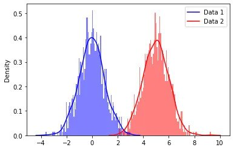
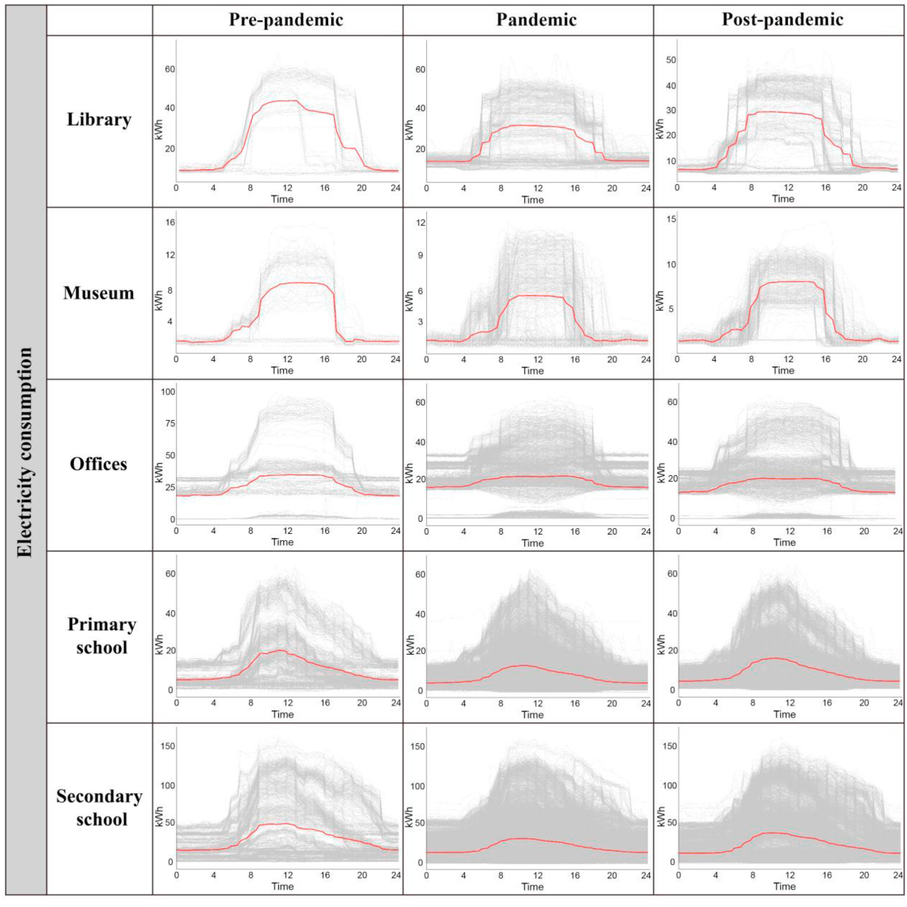
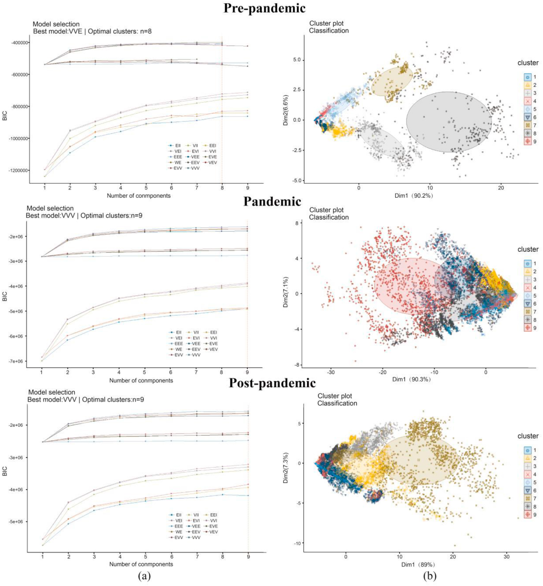

```{r setup, include = FALSE}
library(tidyverse)
library(mosaic)
library(mdsr)
library(knitr)
library(kableExtra)
library(MGMM) #package for fitting GMMs in the presence of missing data
```

# Introduction

In the landscape of machine learning, pattern recognition, and data analysis, the objective and the challenge often lie in capturing intricate data distributions as effectively as possible. It may be convenient to assign a single distribution that seems to fit well enough to a large data set, but it is much more insightful to identify patterns and clusters within the data. Clustering algorithms such as k-means clustering provide solutions to finding the patterns within observations, but such traditional methods still have limitations when it comes to identifying clusters of different shapes and sizes. For working with a diverse data set, the Gaussian mixture model (GMM) employs a combination of multiple Gaussian distributions and, as a result, excels at capturing the various latent structures within the data. [@kumar2022gaussian]



Like k-means clustering, GMM is a type of machine learning algorithm used to classify data into different categories based on the probability distribution. By identifying and merging multiple Gaussian components, the GMM achieves a parametric probability density function represented as a weighted sum of Gaussian component densities. The parameters in the method are estimated from training data using the iterative expectation-maximization (EM) algorithm, and in maximizing likelihood, GMM allows a representation of data that goes beyond the limitations of single-distribution models. The method's ability to model a wide array of distributions (multimodal, non-Gaussian, etc.) has made GMMs essential in various domains such as computer vision, speech recognition, anomaly detection, finance, marketing, and more.

This paper aims to guide readers through the fundamental concepts that underpin GMMs, offering a comprehensive overview of their mathematical formulation, the Expectation-Maximization (EM) algorithm employed for parameter estimation, and the principles that govern their probabilistic nature. Furthermore, we will explore real-world applications where GMMs have demonstrated remarkable efficacy, illustrating their relevance and versatility across diverse domains.


# Gaussian Mixture Models (GMMs)
\label{sec:background}

## The Gaussian Distribution

The most basic concept in probability theory and in statistics is the random variable. A random variable can be understood as a mapping from a random experiment to a variable, and depending on the nature of the experiment and the design of the mapping, a random variable can take on discrete values, continuous values, or a mix of discrete and continuous values. One possible distribution that the resulting values may follow is the singular Gaussian distribution, which has probability density function (PDF)

\begin{equation}
\label{single}
p(x) = \frac{1}{(2\pi)^{1/2} \sigma} exp(-\frac{1}{2}(\frac{x-\mu}{\sigma})^2) \dot{=} N(x; \mu, \sigma^2),
\end{equation}

or $x \sim N(\mu, \sigma^2)$.

The Gaussian distribution is commonly used in many engineering and science disciplines due to its highly desirable computational properties (more detail?), but also from its ability to approximate many naturally occurring real-world data, due to the law of large numbers.

Expanding this definition, we have that a continuous random variable has a Gaussian-mixture distribution if its PDF is specified by

\begin{equation}
\label{mix}
p(x) = \sum_{m=1}^M \frac{c_m}{(2\pi)^{1/2} \sigma_m} exp(-\frac{1}{2}(\frac{x-\mu_m}{\sigma_m})^2) = \sum_{m=1}^M c_m N(\mu_m, \sigma_m^2),
\end{equation}

where $\infty < x < \infty$, $\sigma_m > 0$, and $c_m > 0$ [@yu2015gaussian].

These positive mixture weights sum to 1: $\sum_{m=1}^M c_m = 1$.

The most obvious property of Gaussian mixture distribution is its multimodality ($M>1$ in Equation \ref{mix}), in contrast to the unimodal property of the Gaussian distribution where $M=1$. This makes it possible for GMM to adequately describe many types of physical data exhibiting multimodality poorly suited for a single Gaussian distribution.

Based on Equation \ref{mix}, the expectation of a random variable $x$ with the mixture Gaussian PDF is $E(x) = \sum_{m=1}^M c_m \mu_m$. But unlike a singular, unimodal Gaussian distribution, this simple summary statistic is not very informative unless all the component means, $\mu_m$ for $m = 1, ..., M$, in the Gaussian-mixture distribution are close to each other.

Instead, we use the multivariate generalization of the mixture Gaussian distribution, which has joint PDF

\begin{equation}
\label{joint}
p(x) = \sum_{m=1}^M \frac{c_m}{(2\pi)^{D/2} |\Sigma_m^{1/2}} exp(-\frac{1}{2}(x-\mu_m)^T \Sigma_m^{-1}(x-\mu_m)) = \sum_{m=1}^M c_m N(x; \mu_m, \Sigma_m),
\end{equation}

where $c_m > 0$.

In using the multivariate mixture Gaussian distribution of Equation \ref{mix}, if the variable $x$’s dimensionality, $D$, is large (depends on the context), then the use of full (nondiagonal) covariance matrices ($\Sigma_m$) would involve a large number of parameters. To reduce the number of parameters, one can instead use diagonal covariance matrices for $\Sigma_m$. Alternatively, when $M$ is large, one can also constrain all covariance matrices to be the same. The advantage of using diagonal covariance matrices is significant simplification of computations needed for the applications of the Gaussian-mixture distributions.

## Parameter Estimation

The Gaussian-mixture distributions discussed above contain a set of parameters. In the multivariate case of \ref{mix}, the parameter set consists of $\Theta = \{c_m, \mu_m, \Sigma_m\}$. The parameter estimation problem is motivated by wanting to determine the values of these parameters from data set that we assume to be drawn from the Gaussian-mixture distribution.

It is common to think of Gaussian mixture modeling and the related parameter estimation as a missing data problem, and we want to "learn" appropriate parameters for the distribution, with the connection to the data points being represented as their membership in the individual Gaussian distributions.

Here, we focus on the expectation maximization (EM) algorithm as the maximum likelihood method of choice for parameter estimation of the Gaussian-mixture distribution. The EM algorithm is the most popular technique used to estimate the parameters of a mixture given a fixed number of mixture components, and it can be used to compute the parameters of any parametric mixture distribution. The EM algorithm finds the maximum likelihood of a model through two iterative steps: expectation or E-step and maximization or M-step. It alternates between performing an expectation step and a maximization step to achieve maximum likelihood until a certain stop condition is satisfied or a specified number of iterations is completed [@wan2019novel].

The EM algorithm is especially fitting to use for GMM, as we can express the parameters in their closed forms and iterate through the M-step as follows:

\begin{equation}
\label{c}
c_m^{(j+1)} = \frac{1}{N} \sum_{t=1}^N h_m^{(j)}(t),
\end{equation}

\begin{equation}
\label{mu}
\mu_m^{(j+1)} = \frac{\sum_{t=1}^N h_m^{(j)}(t) x^{(t)}}{\sum_{t=1}^N h_m^{(j)}(t)},
\end{equation}

\begin{equation}
\label{sigma}
\Sigma_m^{(j+1)} = \frac{\sum_{t=1}^N h_m^{(j)}(t) [x^{(t)} - \mu_m^{(j)}][x^{(t)} - \mu_m^{(j)}]^T}{\sum_{t=1}^N h_m^{(j)}(t)},
\end{equation}

The posterior probabilities of these parameters computed from the E-step are given by

\begin{equation}
\label{posterior}
h_m^{(j)}(t) = \frac{c_m^{(j)} N(x^{(t)}; \mu_m^{(j)}, \Sigma_m^{(j)})}{\sum_{i=1}^n c_i^{(j)} N(x^{(t)}; \mu_i^{(j)}, \Sigma_i^{(j)})}.
\end{equation}

Given the current (denoted by superscript $j$ above) estimate for the parameters, the conditional probability for a given observation $x^{(t)}$ generated from mixture component  $m$is determined for each data sample point at $t=1, ..., N$, where $N$ is the sample size. The parameters then update such that the new component weights correspond to the average conditional probability, and each component mean and covariance is the component specific weighted average of the mean and covariance of the entire sample set.

A particular advantage of the EM algorithm is that each successive iteration will not decrease the likelihood, a property not shared by many other maximization techniques. Additionally, the EM algorithm naturally embeds constraints on the probability vector while avoiding extra computational costs to check and maintain appropriate values.

## Summary

Overall, there are three key steps to using Gaussian mixture models for clustering:

1. Determine a covariance matrix that defines how each Gaussian is related to one another. The more similar two Gaussian component distributions are, the closer their means will be and vice versa if they are far away from each other in terms of similarity. A GMM can have a covariance matrix that is diagonal or symmetric (non-diagonal).

2. Decide the number of Gaussian models in each group, which dictates how many clusters there are.

3. Select the hyperparameters that define how the data are optimally separated using GMMs.


# Connections and Comparisons to Other Models
\label{sec:compare}

Compared with traditional k-means clustering algorithm, GMM has two primary advantages. Firstly, it takes into account covariance, which determines the shape of the distribution, so it can fit well when the distribution of the data presents different shapes. Secondly, while k-means belongs to hard classification, GMM belongs to soft classification. This means that k-means clustering outputs a specific category, whereas GMM outputs the probability of each specific category the data points belong to, and GMM can therefore estimate the uncertainty measure of the degree of association between data points and specific categories [@huang2023gaussian].

As a trade-off of GMMs being more flexible than k-means, they can be more difficult to train. K-means is typically faster to converge and more accurate, so it may be preferred in cases where the runtime is an important consideration or generally when the data set is large and the clusters are well-separated. On the other hand, GMMs are more accurate when the data set is small or the clusters are not well-separated.

We know that the EM algorithm enables effective parameter estimation in probabilistic models with incomplete data. By implementing this algorithm, Gaussian mixture models can handle missing data, whereas K-means cannot. This difference makes GMMs more effective in certain applications where the data contains considerable noise or is not well-defined [@kumar2022gaussian].


# Applications in Literature
\label{sec:examples}

* Understanding the impact of COVID-19 on energy consumption: Researchers used the electricity data set of public buildings in Scotland and applied Gaussian Mixture Model (GMM) to explore the changes in electricity usage patterns throughout the pandemic, so as to understand the long-term impact of COVID-19 on energy consumption of public buildings [@huang2023gaussian].





* Finding patterns in medical datasets: Medical researchers use GMMs to segment images into multiple categories based on their content or to find specific patterns in medical datasets. They can determine clusters of patients with similar symptoms, identify disease subtypes, and even predict outcomes.

* Modeling natural phenomena: GMMs can be used to model natural phenomena where it has been found that noise follows Gaussian distributions. This model of probabilistic modeling relies on the assumption that there exists some underlying continuum of unobserved entities or attributes, and that each member is associated with measurements taken at equidistant points in multiple observation sessions.

* Customer behavior analysis: GMMs can be used for performing customer behavior analysis in marketing to make predictions about future purchases based on historical data.

* Stock price prediction: In finance, GMMs can be applied to a stock’s price time series. They can detect changepoints in time series data and help find turning points of stock prices or other market movements that are otherwise difficult to spot due to volatility and noise.

* Gene expression data analysis: GMMs can be used to detect differentially expressed genes between two conditions and to identify which genes might contribute toward a certain phenotype or disease state.


# Implementation in R

## Single Component Without Missingness

For $n$ observations on $d$ dimensional data, we can introduce a fraction of missing values $m$ completely at random by setting elements of the data set to NA.

Here, $n = 1e3$ observations are simulated from a single $k = 1$ bivariate normal distribution $d = 2$ without missingness (miss = 0, by default). The mean is $\mu = (2, 2)$, and the covariance is an exchangeable correlation structure with off-diagonal $\rho = 0.5$.

```{r}
set.seed(495)
sigma <- matrix(c(1, 0.5, 0.5, 1), nrow = 2)
data = rGMM(n = 1e3, d = 2, k = 1, means = c(2, 2), covs = sigma)
fit <- FitGMM(data, k = 1)
show(fit)
```

## Single Component With Missingness

$n = 1e3$ observations are simulated from a single $k = 1$ trivariate normal distribution $d = 3$ with 20% missingness (miss = 0.2). The mean defaults to the zero vector, and the covariance to the identity matrix.

```{r}
set.seed(495)
sigma <- matrix(c(1, 0.5, 0.5, 1), nrow = 2)
data = rGMM(n = 1e3, d = 3, k = 1, miss = 0.2)
fit <- FitGMM(data, k = 1)
show(fit)
```

## Clustering Quality

The function `ClustQual` provides several metrics for internally assessing the quality of cluster assignments from a fitted GMM. The output is a list containing the following metrics:

* BIC (Bayesian information criterion): a penalized version of the negative log likelihood. A lower value indicates better clustering quality.

* CHI (Calinski-Harabaz index): a ratio of the between-cluster to within-cluster variation. A higher value indicates better clustering quality.

* DBI (Davies-Bouldin index): an average of similarities across clusters. A lower value indicates better clustering quality.

* SIL: average silhouette width, a measure of how well an observation matches its assigned cluster. A higher value indicates better clustering quality.

```{r}
set.seed(495)
mu <- list(
  c(2, 2),
  c(2, -2),
  c(-2, 2),
  c(-2, -2)
)
sigma <- 0.5 * diag(2)
data = rGMM(n = 100, d = 2, k = 4, means = mu, covs = sigma)
fit <- FitGMM(data, k = 4, maxit = 100, eps = 1e-8, report = F)

#quality metrics
clust_qual = ClustQual(fit)
cat("BIC:\n")
clust_qual$BIC
cat("\nCHI:\n")
clust_qual$CHI
cat("\nDBI:\n")
clust_qual$DBI
cat("\nSIL:\n")
clust_qual$SIL
```

## Choosing the Number of Clusters

The function `ChooseK` provides guidance on the number of clusters present in data where the number of clusters $k$ is unknown. The inputs include the data matrix, the minimum number of clusters to assess k0, the maximum number of clusters to assess k1, and the number of bootstrap replicates at each cluster number boot. For each cluster number k from k0 to k1, bootstrapped data sets are generated. A GMM with $k$ components is fit, and the quality metrics are calculated. The bootstrap replicates are summarized by their mean and standard error (SE). For each quality metric, the output contains the cluster number k_opt that provides the optimal quality and the smallest cluster number whose quality is within 1 SE of the optimum k_1se.

```{r}
choose_k <- ChooseK(data, k0 = 2, k1 = 6, boot = 10)
cat("\nCluster number choices:\n")
choose_k$Choices
cat("\nAll results:\n")
head(choose_k$Results)
```


# Application to Data


# Conclusion
